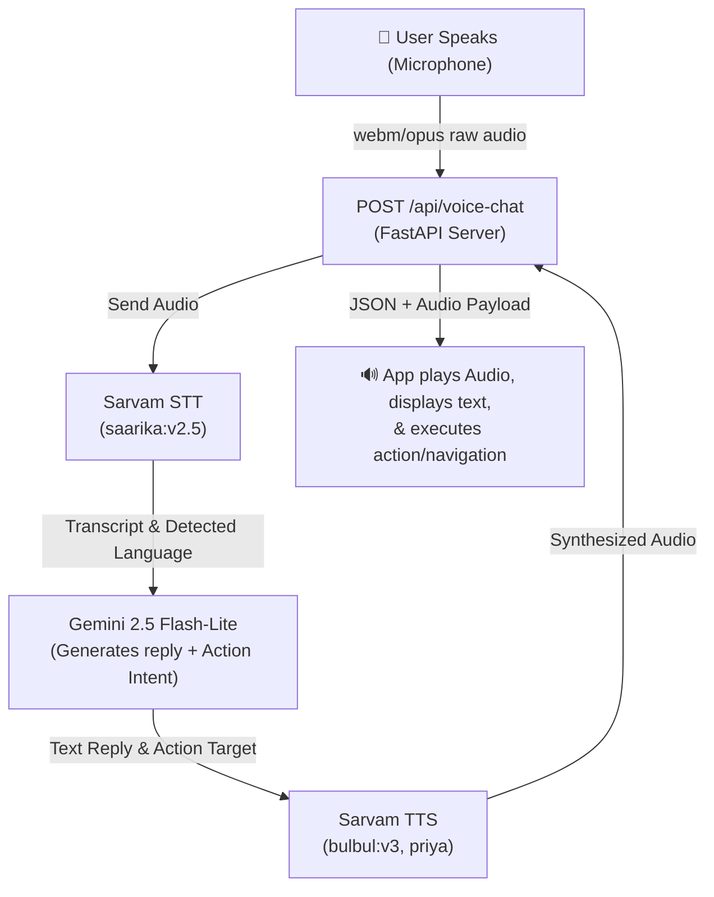

# Antidote+ — AI Snakebite Emergency Network

A mobile-first application for rural India designed to get snakebite victims to critical **treatment** as fast as possible. 

### 💡 The Differentiator
Rather than routing victims to the *nearest* healthcare facility, **Antidote+** routes them to the nearest facility that **actually has anti-snake-venom (ASV) in stock**, while monitoring vital signs and symptoms along the journey so the receiving hospital is fully prepared for arrival. It also supports hands-free, multilingual **voice interactions** to assist users in high-stress emergencies.

---

## 🛠️ Tech Stack & Badges

<p align="center">
  
  
  
  
  
  
</p>

---

## 📋 Table of Contents

- [The Three Pillars](#-the-three-pillars)
- [Demo Flow (One Unbroken Loop)](#-demo-flow-one-unbroken-loop)
- [Voice Assistant Pipeline](#-voice-assistant-pipeline)
- [Tech Stack Details](#-tech-stack-details)
- [Project Structure & Key Files](#-project-structure--key-files)
- [Setup & Run Instructions](#-setup--run-instructions)
  - [Prerequisites](#prerequisites)
  - [1. Shared FastAPI Backend](#1-shared-fastapi-backend)
  - [2. Victim Mobile App](#2-victim-mobile-app)
  - [3. Hospital Staff Dashboard](#3-hospital-staff-dashboard)
  - [4. Android APK Compilation](#4-android-apk-compilation)
- [API Reference](#-api-reference)
- [Architecture & Design Details](#-architecture--design-details)
- [Known Limitations (Hackathon Build)](#-known-limitations-hackathon-build)
- [Verification & Quality Assurance](#-verification--quality-assurance)

---

## 🏛️ The Three Pillars

1. **Nearest ≠ Equipped**  
   Stock-aware routing sends the victim past empty Primary Health Centres (PHCs) to the hospital that actually has antivenom, utilizing a live, timestamped inventory system.
2. **Hands-free Voice Assistant**  
   An offline-resilient, voice-driven pipeline (🎤 speak → transcribe → reason → speak back) answers first-aid questions and executes navigation tasks (e.g., *"take me to a hospital"* transitions to the routing interface; *"how many vials are nearby?"* reads from active inventories).
3. **Unified Backend Architecture**  
   The victim's mobile client and the **hospital staff dashboard** interact with the same FastAPI server. A confirmed case submitted by the victim appears on the hospital's live dashboard board within seconds.

---

## 🔄 Demo Flow (One Unbroken Loop)

> [!IMPORTANT]
> To experience the complete system cycle, follow this unbroken loop:
> 
> 1. Tap **"I've been bitten"** on the home screen.
> 2. Read the **First Aid** instructions (e.g., do not apply a tourniquet, keep the bitten limb immobilized).
> 3. *(Optional)* Take a photo of the snake.
> 4. Start the **Severity Tracker** and check **blurred vision**; note the severity automatically scales to **severe**.
> 5. Click **Find antivenom now**.
> 6. The **Routing Screen** directs you past the *Basti Dawakhana* (0 vials in stock) to the equipped **Malla Reddy Narayana Hospital** (22 vials in stock).
> 7. Tap **Confirm & alert hospital**.
> 8. Watch the case appear on the **Hospital Dashboard's live board** instantly.
> 9. Trigger the **SOS system** to relay worsening symptoms and a live Google Maps location link to pre-configured family contacts.
> 10. Cut your internet connection to view the **Offline Banner** indicating the system is safely operating on cached local storage.
> 
> **Voice Assistant Path:** Navigate to **Home → Voice Assistant**, trigger the microphone, and try saying:
> - *"take me to a hospital"*
> - *"how many antivenom vials are nearby?"*
> - *"which snake is this?"*
>
> The assistant will respond verbally in the language detected (Telugu, Hindi, or English) and automatically trigger navigation controls.
> 
> *Note: Prevention articles and instructions live under **Home → Learn**, completely isolated from the emergency flow.*

---

## 🎙️ Voice Assistant Pipeline



> [!NOTE]
> **Intent Actions:** `route_hospital`, `hospital_stock`, `sos`, `identify_snake`, `track_symptoms`, `first_aid`, or `none`. Actionable intents trigger page changes, whereas information queries (like stock level checking) are answered directly without changing screens.
>
> **Quota-Proof Fallback Protection:** Gemini's free tier allows ~20 requests/day per model. If exceeded, the backend falls back to using the transcribed text for localized keyword extraction, querying live hospital feeds to build text answers, and synthesizing the response.

---

## 📊 Tech Stack Details

| Layer | Technology | Details |
| :--- | :--- | :--- |
| **Frontend** | React 18, Vite, Tailwind CSS, `lucide-react`, `react-router-dom` v6 | Mobile-first 430px design optimized for standard devices. |
| **Mobile Native** | Capacitor 8 | Accesses native features (`@capacitor/geolocation`, `@capacitor-community/text-to-speech`). |
| **Dashboard** | React 18, Vite, Plain CSS | Secure, isolated panel for hospital administrators to edit inventories and view cases. |
| **State & Storage** | React Context (`EmergencyContext`), LocalStorage, IndexedDB | Fully functional offline fallback system. |
| **Backend API** | FastAPI (Python) | Low-overhead server proxying AI calls and maintaining in-memory case state. |
| **AI (Cognitive)** | Gemini 2.5 Flash-Lite | Handles snake identification, severity triage, and voice query routing. |
| **AI (Voice)** | Sarvam AI | STT (`saarika:v2.5`) and TTS (`bulbul:v3`) pipelines. |
| **Mapping & Routing** | Leaflet, `react-leaflet`, OSRM, Haversine | Calculates optimal hospital routing based on inventory status. |
| **Security** | HMAC-Signed Tokens | Lightweight stateless authorization system for hospital endpoints. |

---

## 📂 Project Structure & Key Files

Below is the directory map with links directly to primary logic modules:

* 📄 [index.html](file:///c:/project2/Antidote+/index.html) — Web entry point (defaults to Telugu language viewport).
* ⚙️ Configs: [package.json](file:///c:/project2/Antidote+/package.json) • [vite.config.js](file:///c:/project2/Antidote+/vite.config.js) • [tailwind.config.js](file:///c:/project2/Antidote+/tailwind.config.js) • [capacitor.config.json](file:///c:/project2/Antidote+/capacitor.config.json)
* 🤖 **Capacitor Mobile Shell** — [android/](file:///c:/project2/Antidote+/android)
  * [AndroidManifest.xml](file:///c:/project2/Antidote+/android/app/src/main/AndroidManifest.xml) — Android permissions (Internet, GPS, Audio recording).
  * [network_security_config.xml](file:///c:/project2/Antidote+/android/app/src/main/res/xml/network_security_config.xml) — Cleartext configuration for local API communication during development.
* ⚛️ **Victim Application Source** — [src/](file:///c:/project2/Antidote+/src)
  * [main.jsx](file:///c:/project2/Antidote+/src/main.jsx) & [App.jsx](file:///c:/project2/Antidote+/src/App.jsx) — Application bootstrap, lazy routing definitions, and core layout.
  * [theme.js](file:///c:/project2/Antidote+/src/theme.js) & [i18n.js](file:///c:/project2/Antidote+/src/i18n.js) — Design variables and trilingual translations (Telugu/Hindi/English).
  * [EmergencyContext.jsx](file:///c:/project2/Antidote+/src/context/EmergencyContext.jsx) — Shared state manager preserving user inputs, logs, and navigation selections.
  * 🗃️ **Helper Libraries** — `src/lib/`
    * [api.js](file:///c:/project2/Antidote+/src/lib/api.js) — Network calls to FastAPI endpoints.
    * [hospitals.js](file:///c:/project2/Antidote+/src/lib/hospitals.js) — Live hospital inventory feed helpers.
    * [gemini.js](file:///c:/project2/Antidote+/src/lib/gemini.js) & [image.js](file:///c:/project2/Antidote+/src/lib/image.js) — Gemini API helpers and client-side image compression.
    * [ttsService.js](file:///c:/project2/Antidote+/src/lib/ttsService.js) — Native Capacitor Text-to-Speech adapter.
    * [voiceChatService.js](file:///c:/project2/Antidote+/src/lib/voiceChatService.js) — Audio recording capture and streaming pipeline.
    * [geo.js](file:///c:/project2/Antidote+/src/lib/geo.js) & [db.js](file:///c:/project2/Antidote+/src/lib/db.js) — Geo-coordinate mapping utilities and local IndexedDB database.
  * 📄 **Pages** — `src/pages/`
    * [Home.jsx](file:///c:/project2/Antidote+/src/pages/Home.jsx) — Primary dashboard with entryways to voice assistant and learn paths.
    * [FirstAid.jsx](file:///c:/project2/Antidote+/src/pages/FirstAid.jsx) — Critical DOs/DON'Ts guidelines with native TTS synthesis.
    * [Snake.jsx](file:///c:/project2/Antidote+/src/pages/Snake.jsx) — Camera interface for image analysis via Gemini.
    * [Tracker.jsx](file:///c:/project2/Antidote+/src/pages/Tracker.jsx) — Medical triage loop (symptom monitoring log).
    * [Routing.jsx](file:///c:/project2/Antidote+/src/pages/Routing.jsx) — Stock-aware Leaflet mapping and routing.
    * [VoiceAssistant.jsx](file:///c:/project2/Antidote+/src/pages/VoiceAssistant.jsx) — Microphone assistant panel.
    * [SOS.jsx](file:///c:/project2/Antidote+/src/pages/SOS.jsx) — Contact notification and sharing dashboard.
    * [HandoverViewer.jsx](file:///c:/project2/Antidote+/src/pages/HandoverViewer.jsx) — QR handover screen for healthcare workers.
    * [Demo.jsx](file:///c:/project2/Antidote+/src/pages/Demo.jsx) — Quick setup tool to mock data variables during judging/demo.
* 🏥 **Hospital Staff Dashboard** — [hospital-dashboard/](file:///c:/project2/Antidote+/hospital-dashboard)
  * [auth.jsx](file:///c:/project2/Antidote+/hospital-dashboard/src/auth.jsx) & [api.js](file:///c:/project2/Antidote+/hospital-dashboard/src/api.js) — Login controls and dashboard server queries.
  * `pages/` — Login, Stocks management, incoming Patient Cases (polling), and Analytics.
* 🐍 **Shared Backend** — [backend/](file:///c:/project2/Antidote+/backend)
  * [requirements.txt](file:///c:/project2/Antidote+/backend/requirements.txt) & [backend .env.example](file:///c:/project2/Antidote+/backend/.env.example) — Dependencies and local environment variable setup.
  * `app/`
    * [main.py](file:///c:/project2/Antidote+/backend/app/main.py) — Entry point initializing routing endpoints and CORS settings.
    * [config.py](file:///c:/project2/Antidote+/backend/app/config.py) & [models.py](file:///c:/project2/Antidote+/backend/app/models.py) — Config validation and request models.
    * [auth.py](file:///c:/project2/Antidote+/backend/app/auth.py) — Hospital credentials validation and token signing.
    * `routes/` — Endpoint groups (severity, identify, cases, voice_chat, etc.).
    * `services/` — Internal business logic layers interfacing with Gemini, Sarvam, and memory database states.
* 📁 **Documentation** — `docs/`
  * [JUDGE_CHEATSHEET.md](file:///c:/project2/Antidote+/docs/JUDGE_CHEATSHEET.md) — Fast commands and navigation scripts for judges.
  * [PROJECT_REVIEW.md](file:///c:/project2/Antidote+/docs/PROJECT_REVIEW.md) — Comprehensive technical review.
  * [routing-reference.jsx](file:///c:/project2/Antidote+/docs/routing-reference.jsx) — Core Leaflet routing snippet.

---

## ⚡ Setup & Run Instructions

### Prerequisites
* **Node.js** v18+
* **Python** v3.10 to v3.12
* **Java SDK** 21 + **Android SDK** (for compiling the APK using Capacitor)

### 1. Shared FastAPI Backend
```bash
cd backend
python -m venv .venv

# Activate Virtual Environment:
# On Windows (PowerShell):
.\.venv\Scripts\activate
# On macOS/Linux:
source .venv/bin/activate

pip install -r requirements.txt
cp .env.example .env
```
Open `.env` and configure your API credentials:
```env
GEMINI_API_KEY=your_gemini_key_here
SARVAM_API_KEY=your_sarvam_key_here
```

> [!NOTE]
> **No Keys Fallback:** Without `GEMINI_API_KEY`, the backend falls back to local rules (identifying any snake as "venomous" and using a standard mock handover builder). If `SARVAM_API_KEY` is missing, the voice assistant service will be deactivated while other systems operate normally.

Start the API server:
```bash
uvicorn app.main:app --reload --port 8000
```
Interactive Swagger documentation is available at `http://localhost:8000/docs` while the server is running.

### 2. Victim Mobile App
```bash
# Return to the project root directory
npm install
npm run dev
```
Access the application at `http://localhost:5173`. Proxies `/api/*` requests directly to `localhost:8000`.
Build the client application distribution files (`/dist`) with:
```bash
npm run build
```

### 3. Hospital Staff Dashboard
```bash
cd hospital-dashboard
npm install
npm run dev
```
Access the dashboard at `http://localhost:5174`.

#### Demo Credentials
Use any of the following sets of credentials to log in:
* **District Admin:** `admin` / `admin123` (Full visibility over all hospitals)
* **Malla Reddy Narayana:** `mrn` / `mrn123`
* **Gandhi Hospital:** `gandhi` / `gandhi123`
* **Secunderabad Hospital:** `slg` / `slg123`
* **Reach Hospital:** `reach` / `reach123`
* **Arundathi Hospital:** `arundathi` / `arun123`
* **Basti Dawakhana:** `basti` / `basti123`

### 4. Android APK Compilation
Ensure you have built the victim app distribution folder first:
```bash
npm run build
npx cap sync android
npx cap open android
```
This triggers Android Studio. From there, select **Build > Build Bundle(s) / APK(s) > Build APK(s)** to generate the file.

> [!WARNING]
> **Local Networking Bridge:** When testing on a physical Android device connected to your machine, local network calls targeting `localhost:8000` will fail. 
> To resolve this, run `adb reverse tcp:8000 tcp:8000` via USB, or set `VITE_API_BASE=http://<YOUR_LAPTOP_IP>:8000` and build the application.

---

## 🔌 API Reference

| Endpoint | Method | Security | Description |
| :--- | :---: | :---: | :--- |
| `/health` | `GET` | Open | Health probe checking dependencies and configurations. |
| `/api/identify` | `POST` | Open | Vision endpoint classifying uploaded snake photo files. |
| `/api/summarize` | `POST` | Open | Generates clinical handover logs from symptom tracking text. |
| `/api/severity` | `POST` | Open | Triage helper mapping lists of symptoms to severity ratings. |
| `/api/hospitals` | `GET` | Open | Pulls live hospital list, active ASV stock, and GPS coordinates. |
| `/api/hospitals/{id}/stock` | `POST` | Hospital Auth | Allows a hospital user to edit their facility's antivenom stock. |
| `/api/auth/login` | `POST` | Open | Validates credentials and returns authorization tokens. |
| `/api/auth/me` | `GET` | Token Auth | Identifies and validates active user credentials. |
| `/api/cases` | `POST` | Open | Submits a case report alerting the designated target hospital. |
| `/api/cases` | `GET` | Hospital Auth | Feeds live patient alerts to the corresponding hospital panel. |
| `/api/voice-chat` | `POST` | Open | Processes input audio streams and returns verbal TTS responses. |
| `/api/tts` | `POST` | Open | Converts custom text strings to synthesized verbal audio. |
| `/api/stt` | `POST` | Open | Transcribes audio speech content to text. |

---

## 🏛️ Architecture & Design Details

* **Emergency Context Manager:** [EmergencyContext.jsx](file:///c:/project2/Antidote+/src/context/EmergencyContext.jsx) functions as the unified source of truth across pages, holding language configurations, bite timestamps, victim GPS locations, snake images, symptom trackers, and designated hospital picks.
* **Dashboard Case Feeds:** The hospital dashboard's patient monitor polls `GET /api/cases` every 4 seconds to instantly highlight incoming alerts without requiring page refreshes.
* **Offline Resilience:** All primary tools are engineered to execute out of client-side contexts. Stock tables display badges (e.g. `live`, `cached`, or `seeded`) indicating the integrity of shown data, and outbox queues store SOS requests locally until internet connectivity is restored.

---

## ⚠️ Known Limitations (Hackathon Build)

- **Gemini Free-Tier Rate Limits:** The pipeline uses `gemini-2.5-flash-lite` for voice processing and `gemini-2.5-flash` for classification tasks. These models are limited to ~20 requests daily. Exceeding this triggers the system's keyword fallback pipeline.
- **Audio Codec Compatibility:** The client-side recorder is built on `webm/opus`. Sarvam AI fully supports this format, but performance can vary across native Android WebView configurations.
- **Volatile Storage:** Database items (active cases, live hospital stocks) are currently maintained in RAM memory on the FastAPI instance and reset when the server restarts.

---

## 🧪 Verification & Quality Assurance

1. **Compilation Check:** 
   Confirm build builds succeed for both frontends:
   * Client: `npm run build` compiles into `/dist` without TypeScript or bundle warnings.
   * Dashboard: `npm run build` runs smoothly.
2. **Backend Services Smoke Test:**
   * `/health` resolves to status `OK`.
   * Auth token handshakes execute on `/api/auth/login`.
   * Voice pipelines verify correctly via `/api/test_sarvam` (when local test scripts are activated).
